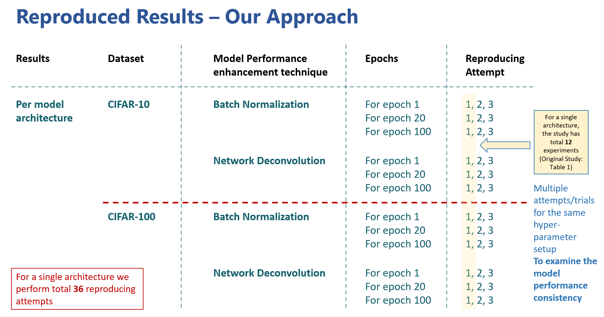

# Rep. Network Deconvolution [](https://github.com/yechengxi/deconvolution)
This repository is a reproducibility study of [Network Deconvolution](https://github.com/yechengxi/deconvolution); the original work proposed by Ye et al. (2020). This reproducibility study is conducted
to evaluate the ability to reproduce the results with current library dependencies, given that five years have passed since the original publication. The project requires Python GPU-based processing capabilities, TensorFlow and PyTorch frameworks." 

README file of the original study is available at `original_paper/README.md`. 

## Original Paper
```
@misc{ye2020network,
      title={Network Deconvolution}, 
      author={Chengxi Ye and Matthew Evanusa and Hua He and Anton Mitrokhin and Tom Goldstein and James A. Yorke and Cornelia Fermüller and Yiannis Aloimonos},
      year={2020},
      eprint={1905.11926},
      archivePrefix={arXiv},
      primaryClass={cs.LG}
}
```

## Folder structure 
```
    .
    ├───segmentation        # Semantic Segmentation using "Cityscapes" dataset 
    ├───documents           # reproducibility study documentation related files
    ├───imagenet            # created folder to store imagenet images
    ├───models              # model architecture implementations
    ├───original_paper      # documents from original study
    ├───results             # results obtained from reproducibility study
    │   LICENSE
    │   README.md
    │   arg_parser.py
    │   cs895_project.ipynb
    │   imagenet_single_experiment_densenet121.sh
    │   imagenet_single_experiment_densenet121_deconv.sh
    │   imagenet_single_experiment_resnet.sh
    │   imagenet_single_experiment_resnet_deconv.sh
    │   imagenet_single_experiment_vgg11_BN.sh
    │   imagenet_single_experiment_vgg11_deconv.sh
    │   imagenet_single_experiment_vgg11_original.sh
    │   main.py
    │   main_imagenet.py
    │   net_util.py
    │   requirements.txt
    │   single_experiment_cifar10.sh
    │   single_experiment_cifar100.sh
    │   single_experiment_net_deconv_cifar10.sh
    │   single_experiment_net_deconv_cifar100.sh
    │   util.py
    └   valprep.sh
```


## Dependencies ##
All the required dependencies included in the `requirements.txt` file. Codebase is tested on below python library versions.

* scipy==1.10.1
* numpy==1.23.5
* tensorboard==2.12.0
* matplotlib=3.7.1
* torch==1.13
* torchvision==0.14.1
* tensorflow==2.12.0

## Preparing Imagenet dataset to reproduce results from Table 2 ##
It is no longer possible to download ILSVRC subset from the original source on the ImageNet website. Instead, the site now directs users to the dataset hosted on Kaggle https://www.kaggle.com/c/imagenet-object-localization-challenge/data. 

We followed the below steps to properly preapre the dataset folder structure
- Created a folder called 'imagenet' on the root directory of the codebase
- Inside the created 'imagenet' folder unzipped the downloaded ILSVRC.zip from https://www.kaggle.com/c/imagenet-object-localization-challenge/data
- The folder structure should be similar to below
    ```
    imagenet
        |----ILSVRC
                |----Annotation
                |----ImageSets
                |----Data
                      |----CLS-LOC
                               |----test
                               |----train
                               |----val
                                      |----ILSVRC2012_val_00000009.JPEG
                                      |----ILSVRC2012_val_00000010.JPEG
                                      |----...
    ```
- Since imagenet/ILSVRC/Data/CLS-LOC/val folder does not contain the subfolders for each class, we ceated those class folders and stored the images in related class folders using the `valprep.sh` script provided by NVIDIA https://docs.nvidia.com/deeplearning/dali/archives/dali_08_beta/dali-developer-guide/docs/examples/pytorch/resnet50/pytorch-resnet50.html 
- Move the `valprep.sh` inside `imagenet/ILSVRC/Data/CLS-LOC/val` folder which is initially available in the root directory of the codebase and run it
- The updated folder structure will be similar to below
    ```
    .
    ├───segmentation        # Semantic Segmentation using "Cityscapes" dataset 
    ├───documents           # reproducibility study documentation related files
    ├───imagenet            # created folder to store imagenet images           
    |   |----ILSVRC
    |            |----Annotation
    |            |----ImageSets
    |            |----Data
    |                  |----CLS-LOC
    |                           |----test
    |                                  |----ILSVRC2012_test_00013640.JPEG
    |                                  |----ILSVRC2012_test_00056622.JPEG
    |                                  |----ILSVRC2012_test_00020698.JPEG
    |                                  |----...                               
    |                           |----train
    |                                  |----n01440764
    |                                        |----n01440764_10026.JPEG
    |                                        |----n01440764_10027.JPEG
    |                                  |----n01443537
    |                                        |----n01443537_10007.JPEG
    |                                        |----n01443537_10014.JPEG
    |                                  |----...                               
    |                           |----val
    |                                  |----n01440764
    |                                        |----ILSVRC2012_val_00000293.JPEG
    |                                        |----ILSVRC2012_val_00002138.JPEG
    |                                  |----n01443537
    |                                        |----ILSVRC2012_val_00000236.JPEG
    |                                        |----ILSVRC2012_val_00000262.JPEG
    |                                  |----...
    ├───models              # model architecture implementations
    ├───original_paper      # documents from original study   
    ```

## Reproducibility Approach ##
We focused on the reported data from Table 1 and Table 2 in the original study for both Batch Normalization and Network Deconvolution scenarios. Below figure shows our apporach in reproducing the results from original paper Table 1. 



## Resolved minor issues ##
There were a few minor module import issues and some Python library version conflicts in the codebase, and below is how we resolved them.
> main.py
* No module named `torchvision.models.utils`
    - Error with pytorch 1.10+ versions. Resolved by changing 
        ```
        from torchvision.models.utils import load_state_dict_from_url
            to
        from torch.hub import load_state_dict_from_url
        ```
* NameError: name 'DPN92' is not defined
    - A Model import error. Resolved by importing the models to main.py
* NameError: name 'PreActResNet18' is not defined
    - A Model import error. Resolved by importing the models to main.py

> main_imagenet.py
* RuntimeError: view size is not compatible with input tensor's size and stride (at least one dimension spans across two contiguous subspaces)
    - Resolved by changing 
        ```
        correct_k = correct[:k].view(-1).float().sum(0, keepdim=True)
            to
        correct_k = correct[:k].contiguous().view(-1).float().sum(0, keepdim=True)
        ```

## Steps we have followed to reproduce the original study ##

1. Clone the GitHub repository https://github.com/yechengxi/deconvolution
2. Create a python virtual environment https://docs.python.org/3/library/venv.html
3. Activate venv, navigate to the cloned repository and install the dependencies using `requirements.txt` file

    ```
        pip install -r requirements.txt
    ```
4. Created a Jupyter Notebook `deconv_rep.ipynb` to test the scripts 
5. To reproduce results from Table 1 (`main.py`), we used bash scripts to schedule slurm jobs and passed related arguments for below parameters: 
    - prameters
        - architecture - neural network architecture name [ vgg16, resnet18d, preact, densenet121, resnext, mobilev2, dpn, pnasnetA, senet, efficient ]
        - epochs - [ 1, 20, 100 ]
        - o -- slurm output filename
    - bash commands 
        - for batch normalization with CIFAR-10 dataset [ `single_experiment_cifar10.sh` ]
            ```
            sbatch --export=ALL,architecture='pnasnetA',epochs=100 -o pnasnetA_cifar100_ep100_att2_BN.txt single_experiment_cifar10.sh
            ```
        - for batch normalization with CIFAR-100 dataset [ `single_experiment_cifar100.sh` ]
            ```
            sbatch --export=ALL,architecture='pnasnetA',epochs=100 -o pnasnetA_cifar100_ep100_att2_BN.txt single_experiment_cifar100.sh
            ```
        - for network deconvolution with CIFAR-10 dataset [ `single_experiment_net_deconv_cifar10.sh` ]
            ```
            sbatch --export=ALL,architecture='pnasnetA',epochs=100 -o pnasnetA_cifar100_ep100_att2_BN.txt single_experiment_net_deconv_cifar10.sh
            ```
        - for network deconvolution with CIFAR-100 dataset [ `single_experiment_net_deconv_cifar100.sh` ]
            ```
            sbatch --export=ALL,architecture='pnasnetA',epochs=100 -o pnasnetA_cifar100_ep100_att2_BN.txt single_experiment_net_deconv_cifar100.sh
            ```
6. To reproduce results from Table 2 (`main_imagenet.py`), we used below 7 bash scripts to schedule slurm jobs with default model parameters and 90 epochs:
    > DensetNet-121
    - for batch normalization with ImageNet dataset [ `imagenet_single_experiment_densenet121.sh` ]
        ```
       sbatch -o imagenet_densenet.txt imagenet_single_experiment_densenet121.sh
        ```
    - for Network Deconvolution with ImageNet dataset [ `imagenet_single_experiment_densenet121_deconv.sh` ]
        ```
       sbatch -o imagenet_densenet_deconv.txt imagenet_single_experiment_densenet121_deconv.sh
        ```
    > ResNet-18
    - for batch normalization with ImageNet dataset [ `imagenet_single_experiment_resnet.sh` ]
        ```
       sbatch -o imagenet_single_experiment_resnet.txt imagenet_single_experiment_resnet.sh
        ```
    - for Network Deconvolution with ImageNet dataset [ `imagenet_single_experiment_resnet_deconv.sh` ]
        ```
       sbatch -o imagenet_single_experiment_resnet_deconv.txt imagenet_single_experiment_resnet_deconv.sh
        ```
    > VGG-11
    - for original implementation with ImageNet dataset [ `imagenet_single_experiment_vgg11_original.sh` ]
        ```
       sbatch -o imagenet_single_experiment_vgg11_original.txt imagenet_single_experiment_vgg11_original.sh
        ```
    - for batch normalization with ImageNet dataset [ `imagenet_single_experiment_vgg11_BN.sh` ]
        ```
       sbatch -o imagenet_single_experiment_vgg11_BN.txt imagenet_single_experiment_vgg11_BN.sh
        ```
    - for Network Deconvolution with ImageNet dataset [ `imagenet_single_experiment_vgg11_deconv.sh` ]
        ```
       sbatch -o imagenet_single_experiment_vgg11_deconv.txt imagenet_single_experiment_vgg11_deconv.sh
        ```

7. Stored findings and graphs inside `results` directory 
    - rep_values.xlsx
        - original_values       # Values reported in both Table 1 and Table 2 of the original study 
        - rep_values_t1         # reproduced values from table 1 (3 attempts per each value)
        - rep_averaged_t1       # averaged reproduced values from table 1 
        - image_net_t2          # reproduced values from table 2

    - graphs
        - densenet121-ep20-cifar10.png
        - resnet18-ep20-cifar10.png
        - vgg16-ep20-cifar10.png

## To reproduce results of our reproducibility study ##

1. Clone the GitHub repository https://github.com/rochanaro/cs895-deconvolution.git
2. Download Imagenet and preapre the dataset according to the steps mentioned in previous section "Preparing Imagenet dataset to reproduce results from Table 2" 
3. Install python library requirements
    ```
        pip install -r requirements.txt
    ```
4. Test the scripts by executing cells in  `deconv_rep.ipynb` notebook
5. For Table 1 results, run the provided bash scripts passsing appropriate model parameters mentioned in section "Steps we have followed to reproduce the original study" list item 5
6. For Table 2 results, run the provided bash scripts as mentioned in section "Steps we have followed to reproduce the original study" list item 6


```BibTeX

```

```
Rochana R. Obadage | Kumushini Thennakoon 
05/25/2024
```